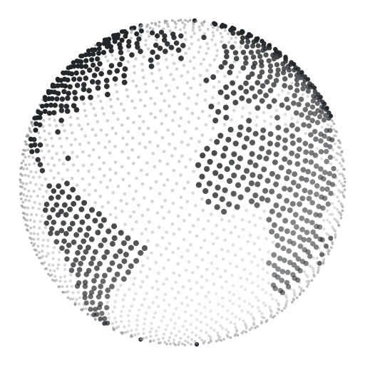

<p align="center">
  <picture>
    <source media="(prefers-color-scheme: dark)" srcset="docs/assets/mark-dark.svg">
    
  </picture>
</p>

<h1 align="center">Mercature</h1>

<p align="center">
  <a href="#get-started">Get started</a> ·
  <a href="docs/product.md">Product</a> ·
  <a href="docs/language.md">Model</a> ·
  <a href="docs/evidence.md">Evidence</a> ·
  <a href="docs/architecture.md">Architecture</a>
</p>

<p align="center">
  <a href="https://github.com/glendonC/mercature/actions/workflows/check.yml"></a>
  <a href="package.json"></a>
</p>

Peru welcomed over four million international visitors in 2025, and 7 in 10 of its workers are
in businesses of ten people or fewer. Small tour operators live on what visitors tell them, and much
of it arrives in languages they cannot read, about places they cannot easily check.

Mercature keeps a tour operator's walk on her phone, built from public street photos, and reads
her visitors' messages for her. A small multilingual model on the phone says whether a message is a
problem, praise or a question and which spot on the walk it means, and the map flies there. A reply
in the visitor's language is drafted from fixed templates and what her map says, ready to copy. When
the model is unsure she taps the spot herself. She keeps the map current: mark a spot fixed, add a
note, remove a spot or add one. After one download, it works offline.

Built for the World Bank Small AI for Development challenge, tourism track.

<sub>Figures: 4,157,469 international visitors to Peru in 2025, preliminary (MINCETUR, <a href="https://www.gob.pe/institucion/mincetur/informes-publicaciones/7619520-reportes-de-turismo-reporte-mensual-de-turismo-diciembre-2025">Reporte Mensual de Turismo, diciembre 2025</a>, 14 January 2026); 71.7% of Peru's employed people work in units of 1 to 10 people, 88.6% of them informally (INEI, <a href="https://m.inei.gob.pe/media/MenuRecursivo/boletines/01-informe-tecnico-empleo-nacional.pdf">mercado laboral, enero a diciembre 2025</a>, February 2026).</sub>

## The Qorikancha walk

A real route in Cusco, from the Plaza de Armas to the Qorikancha ticket booth: 594 m in 60
stretches, seen through 403 Mapillary street photos taken between 2015 and 2023. A large
segmentation model scanned 116 views of those photos once, when the route was prepared, and made 479
marks above its threshold; the package keeps 287 of them (footway, cobblestones, kerbs, road, steps, crossings, broken pavement), the
218 near the walk and 69 more on the 27 published photos. Separately, the walk's build has 52 findings
of steps and kerbs on its stretches, including one OpenStreetMap steps tag. 8 of the 52 are flagged as
possible barriers; none has been checked by a person.
A stretch with no flagged barrier means only that no barrier was seen in the photos: Mercature
claims no widths, slopes or reachability.

## The model

[multilingual-e5-small](https://huggingface.co/intfloat/multilingual-e5-small) (MIT), int8 and
trimmed to Latin and Korean script, with three small trained heads, runs in the browser with ONNX
Runtime Web. It downloads once and then works with no connection: 83,783,194 bytes stored on the device, about 52 MB over the network because GitHub Pages compresses it. It answers only
from fixed lists and says Not sure when unsure. On 48 held-out English, Spanish and Korean messages
about the farm it put the right spot first 46 times; moved to the Qorikancha walk with no new
training, 28 of 31. It failed on Quechua, so messages that do not look like English, Spanish or
Korean now always get Not sure. For messages that fail that check, the phone also learns from her: when she taps the
spot, it keeps the link on the device, and later similar messages rank that spot first, still as Not sure. On
machine-translated Quechua test messages the right spot came first for 5 of 16 with no links, and
7.3, 8.8 and 9.4 with one, two and three linked messages per spot. A Korean message lost its right
spot in a few draws, so after that test the memory was limited to messages that fail the language
check. A simpler keyword match is not enough: exact aliases find the spot as often (46 of 48) but would flag a place for all 15 praise, negation and resolved messages, and on the walk they pick exactly the right spots for only 3 of 34 messages. One message takes a median of 25 to 38 ms in Chromium on the development Mac, and 156 to 221 ms
with the CPU slowed six times; no phone has been measured.
All test messages are synthetic, written by a large language model; the farm-tour messages from the
brief's persona, Noor, trained the model's heads. Details: [model and
evaluation](docs/language.md). Privacy, consent, bias and oversight: [responsible AI](docs/product.md#responsible-ai).

## Get started

Try it at [glendonc.github.io/mercature](https://glendonc.github.io/mercature/). Nothing downloads until you tap Download on a message; after that one download, the model works offline. Interface in English and Spanish. The Spanish interface, and the Spanish and Korean notes and replies, have not been reviewed by a native speaker.

To run it locally, you need Node.js 22.12 or newer.

```sh
npm ci
npm run dev
```

Open [127.0.0.1:4173](http://127.0.0.1:4173) and tap **Qorikancha**. The model downloads only when you tap Download on a message. A fresh
clone fetches the full 146,524,765-byte files from Hugging Face; to serve the trimmed 83,783,194-byte copy as the live
site does, run `bash scripts/release/model.sh` first (it needs [uv](https://docs.astral.sh/uv/); see [deploy](docs/deploy.md)). To try the installable offline build, run
`npm run build` and `npm run preview`.

## Checks

```sh
npx playwright install chromium
npm run check:fast
npm run check:ui
bash scripts/checks/gate.sh
```

- `check:fast` type-checks and runs the domain checks in about four seconds.
- `check:ui` runs the browser checks against a server you already started.
- `gate.sh` builds the app, starts its own preview, runs everything, and restarts a browser with
  networking off to test the offline loop.

Set `MERCATURE_PORT` to use a port other than 4173.

## Data and credits

Street photos are by Mapillary contributors under CC BY-SA 4.0, credited on every photo; this
repository ships the route's package in `public/places/qorikancha`, with 27 credited photo crops. Places and paths are
from OpenStreetMap (ODbL), the walking route from Valhalla, outlines from SAM 3. Partial 3D from VGGT
exists only in a local install; the published package has no points. Test messages are synthetic (CC0) and none has been reviewed by a native speaker. The sources
behind every figure, and what the data does not cover, are in [evidence](docs/evidence.md); licenses
are in [attribution](ATTRIBUTION.md).

## Documentation

| Start here | Go deeper |
| --- | --- |
| [Product](docs/product.md) | [Architecture](docs/architecture.md) |
| [Model and evaluation](docs/language.md) | [Deploy](docs/deploy.md) |
| [Evidence and data](docs/evidence.md) | [Attribution](ATTRIBUTION.md) |
