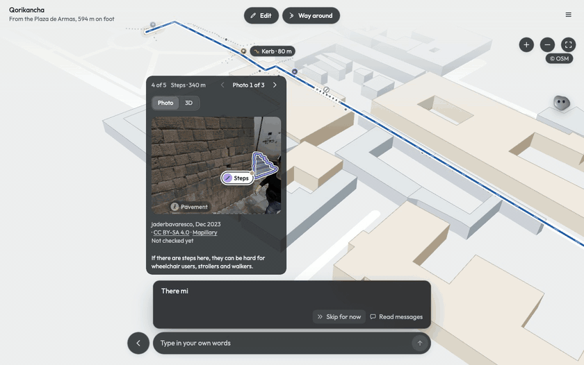
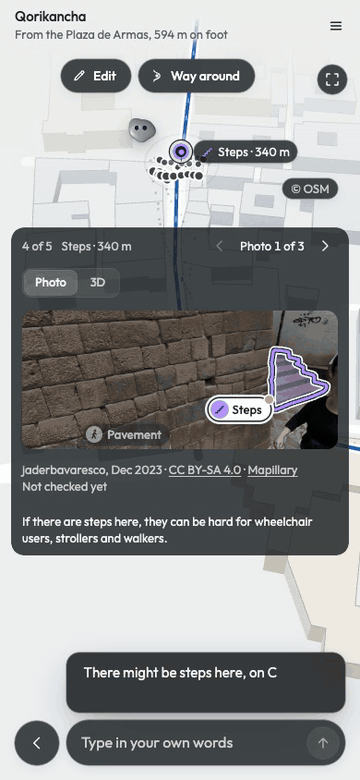
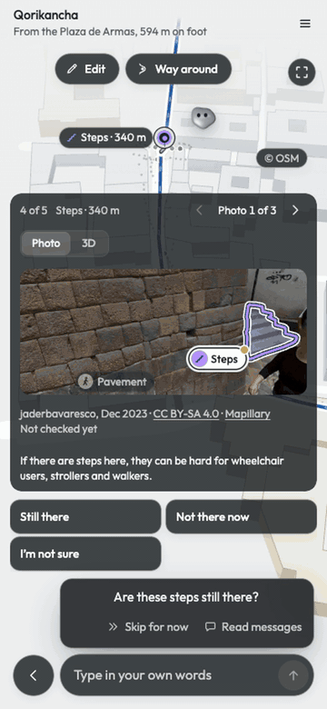
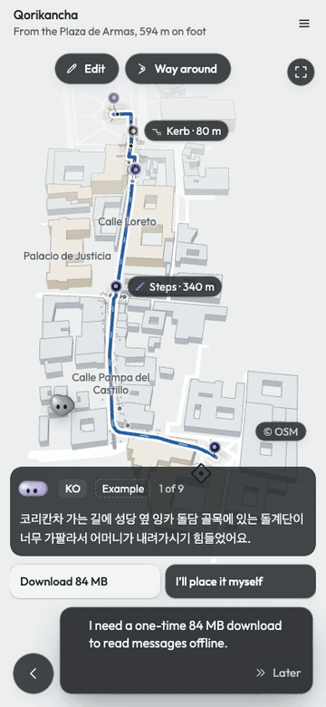
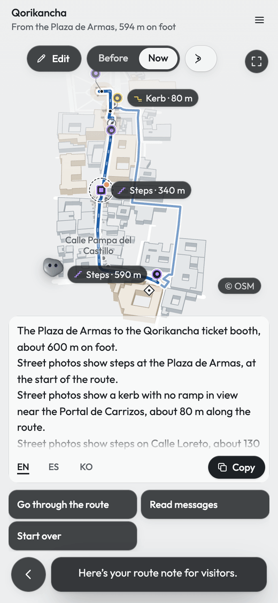
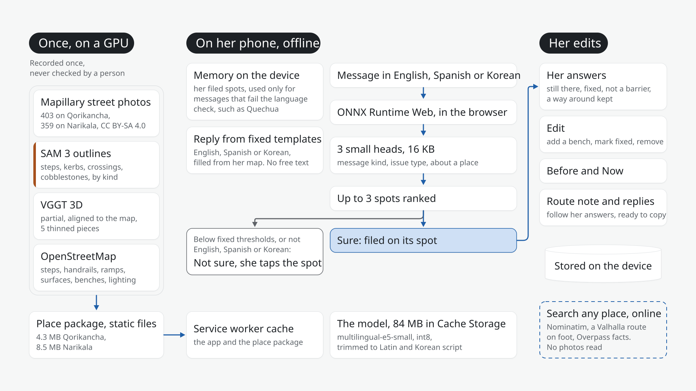

<p align="center">
  <picture>
    <source media="(prefers-color-scheme: dark)" srcset="docs/assets/mark-dark.svg">
    
  </picture>
</p>

<h1 align="center">Mercature</h1>

<p align="center">An editable spatial accessibility model</p>

<p align="center">
  <a href="https://glendonc.github.io/mercature/"><strong>Open the app</strong></a>
  &nbsp;·&nbsp;
  <a href="docs/report.pdf">Report</a>
  &nbsp;·&nbsp;
  <a href="#how-it-works">How it works</a>
  &nbsp;·&nbsp;
  <a href="#results">Results</a>
  &nbsp;·&nbsp;
  <a href="#data">Data</a>
</p>

<br>

<p align="center">
  
</p>
<p align="center"><sub>The Calle Loreto steps in Cusco. Street photo: jaderbavaresco, Mapillary, CC BY-SA 4.0.</sub></p>

## Overview

Small tour operators in Peru hear from visitors in languages they cannot read, about places on their
routes they cannot easily check. Peru had 4,157,469 international visitors in 2025, and 71.7% of its
workers are in units of 1 to 10 people.

Mercature puts the operator's route on her phone, built from public street photos and OpenStreetMap.
An on-screen guide takes her to each spot that might give visitors trouble, with the street photo
where a model outlined steps or a kerb, what OpenStreetMap records there and who it affects. She says
what is there now, keeps a way around if it works, adds what the photos missed and compares Before
and Now.

A small multilingual model on the phone reads her visitors' messages and says which spot each one
means, or Not sure, so she decides. Replies in English, Spanish or Korean are filled from fixed
templates and her answers, never generated. The model is multilingual-e5-small trimmed to 84 MB, with
three small trained classifiers; it runs in the browser and works offline after one download.

Two real routes, in Cusco and Tbilisi, are built from 403 and 359 public street photos, with partial
3D made from them, and search builds a route to any other place from OpenStreetMap alone. Every test
message is synthetic and none has been reviewed by a native speaker. Nothing has been measured on
site, and Mercature claims no widths, slopes or reachability.

The one-page report: [docs/report.pdf](docs/report.pdf).

<br>

<table>
  <tr>
    <td width="50%" valign="top">
      <strong>Check the route</strong><br>
      The guide shows each spot that might stop a visitor: the street photo, the model's outline and
      what OpenStreetMap records there. She says what is there now.
    </td>
    <td width="50%" valign="top">
      <strong>Edit the map</strong><br>
      Add what the photos missed or change a spot, and undo any change. Before / Now compares the
      route with and without her changes. Some spots also open in 3D.
    </td>
  </tr>
  <tr>
    <td align="center"></td>
    <td align="center"></td>
  </tr>
  <tr>
    <td width="50%" valign="top">
      <strong>Read messages</strong><br>
      The model places each English, Spanish or Korean message on the spot it means, or answers Not
      sure and she picks. Replies are filled in the visitor's language from fixed templates.
    </td>
    <td width="50%" valign="top">
      <strong>Share a route note</strong><br>
      Her answers become a note for the next visitors, in English, Spanish or Korean.
    </td>
  </tr>
  <tr>
    <td align="center"></td>
    <td align="center"></td>
  </tr>
</table>

<sub>Messages that ship with the app are labelled Example. Street photos: Mapillary contributors, CC BY-SA 4.0, credited on screen. Map data © OpenStreetMap contributors, ODbL.</sub>

## How it works

<p align="center">
  
</p>

Large models run once per place, on a GPU: SAM 3 outlines steps and kerbs in Mapillary street
photos and VGGT builds partial 3D from them. With what OpenStreetMap records along the route, they
become a static package of a few megabytes, 4.3 MB for Qorikancha and 8.5 MB for Narikala.

Everything else runs on the phone. There is no server and no account, and messages and edits stay
on the device. Architecture and how to add a place: [docs/architecture.md](docs/architecture.md).

## The model

| Part | Detail |
| --- | --- |
| Encoder | [multilingual-e5-small](https://huggingface.co/intfloat/multilingual-e5-small) (MIT), int8, trimmed to Latin and Korean script |
| Heads | Three small trained classifiers, 16 KB |
| Download | 84 MB once (about 52 MB over the network), then offline |
| Runtime | ONNX Runtime Web, in the browser |
| Speed | 25 to 38 ms per message in Chromium on the development Mac, 156 to 221 ms with the CPU slowed six times. No phone measured yet |
| Output | A spot from the place's own list, or Not sure with up to three candidates. It never writes text |
| Languages | English, Spanish and Korean. Anything else, such as Quechua, is always Not sure |
| Memory | Messages she places become examples on the phone, stored as numbers and never as text, and used only for messages the model cannot read |

Replies, the route note and the guide's lines are fixed templates filled from her answers. Details:
[docs/language.md](docs/language.md).

## Results

| Test | Result |
| --- | --- |
| Right spot first, held-out English, Spanish and Korean messages, preregistered | 46 of 48 |
| Right spot first on the Qorikancha route, no retraining | 28 of 31, all in the top three |
| Keyword matching instead, exactly the right spots on the route | 3 of 34 |
| Held-out Quechua messages answered Not sure | 22 of 22 |
| Machine-translated Quechua, right spot first after three linked messages per spot | 9.4 of 16, from 5 |
| Offline, after one download | A new message read with networking off, no request made |

The model's heads were trained on synthetic messages about Noor's farm from the brief. Every test
message was written by a large language model, and none has been reviewed by a native speaker.
Method, failures and data: [docs/language.md](docs/language.md) and [docs/evidence.md](docs/evidence.md).

## Places

| Place | Route | Street photos | Possible barriers |
| --- | --- | --- | --- |
| Qorikancha, Cusco | 594 m, Plaza de Armas to the ticket booth | 403 | 8, at 5 spots |
| Narikala, Tbilisi | 1,020 m, cable car to the fortress gate | 359 | 49, at 14 spots |
| Any place, from search | Built on the device from OpenStreetMap | None read | What OpenStreetMap records |

Routes from search are labelled as from the map. To prepare a new place, see
[Add a place](docs/architecture.md#add-a-place).

## Data

| Dataset | Contents | Licence |
| --- | --- | --- |
| [public/places/qorikancha](public/places/qorikancha) | The Qorikancha route: 60 stretches, 52 findings, 403 photo records, 27 credited street-photo views with SAM 3 outlines, 44 OpenStreetMap records, the way around and 5 thinned point-cloud pieces | CC BY-SA 4.0 for photos and 3D, ODbL for map data |
| [public/places/narikala](public/places/narikala) | The Narikala route, prepared the same way: 102 stretches, 166 findings, 359 photo records, 72 credited views, 95 OpenStreetMap records and 5 point-cloud pieces | CC BY-SA 4.0, ODbL |
| [scripts/language](scripts/language) | Synthetic visitor messages the model was trained and tested on: 403 in 127 families, 44 about the Qorikancha route and 273 for the memory test | CC0 |
| Model files | Not in the repository. The live site serves the trimmed encoder from its own origin, and `bash scripts/release/model.sh` rebuilds it from the pinned Hugging Face files | MIT |

Sources, and what the data does not cover: [docs/evidence.md](docs/evidence.md).

## Limits

- Nothing has been measured on site. It never states a width, height, slope or reachability, or that
  a place is accessible. Flags say "might", and none has been checked by a person.
- A way around is OpenStreetMap's router's suggestion, unchecked.
- Quechua examples are machine-translated. The Spanish interface and the Spanish and Korean replies
  and notes have not been reviewed by a native speaker.
- The operator decides. Nothing on the map changes without her tap, and she copies every reply
  herself.

Privacy, consent, bias and oversight: [docs/product.md](docs/product.md#responsible-ai).

## Run it locally

Try it at [glendonc.github.io/mercature](https://glendonc.github.io/mercature/). The 84 MB model downloads only when you tap Download on a message; after that one download, it works offline. Interface in English and Spanish.

Search is the one feature that goes online. Typing filters the prepared places on your device;
Enter sends the typed words to OpenStreetMap's Nominatim. Building a route asks the Valhalla server
at openstreetmap.de for the route on foot, and the Overpass API (overpass-api.de, or maps.mail.ru as
a second server) for map data near it. A built route is kept on the device. Visitor messages, her
answers and her edits never leave it.

To run it locally, you need Node.js 22.12 or newer.

```sh
npm ci
npm run dev
```

Open [127.0.0.1:4173](http://127.0.0.1:4173) and tap **Qorikancha**. The model downloads only when you tap Download on a message. A fresh
clone fetches the full 146,524,765-byte files from Hugging Face; to serve the trimmed 83,783,194-byte copy as the live
site does, run `bash scripts/release/model.sh` first (it needs [uv](https://docs.astral.sh/uv/); see [deploy](docs/deploy.md)). To try the installable offline build, run
`npm run build` and `npm run preview`.

```sh
npx playwright install chromium
npm run check:fast
npm run check:ui
bash scripts/checks/gate.sh
```

`check:fast` type-checks and runs the domain checks in a few seconds. `check:ui` runs the browser
checks against a server you already started. `gate.sh` builds the app, runs everything and restarts
a browser with networking off to test the offline loop. Set `MERCATURE_PORT` to use a port other
than 4173.

## Credits

Street photos by Mapillary contributors (CC BY-SA 4.0), credited on every photo; the published
packages carry 27 and 72 credited photo views. Map data, places and the records along each route ©
OpenStreetMap contributors (ODbL). Routes on foot and ways around from Valhalla, outlines from SAM 3,
and partial 3D from VGGT, published in thinned pieces under CC BY-SA 4.0. The encoder is
multilingual-e5-small (MIT), run with ONNX Runtime Web (MIT). Outfit (SIL Open Font License 1.1),
bot-avatars (MIT). Test messages are synthetic (CC0). Licences: [ATTRIBUTION.md](ATTRIBUTION.md).

Documentation: [product](docs/product.md) · [architecture](docs/architecture.md) ·
[model](docs/language.md) · [evidence](docs/evidence.md) · [deploy](docs/deploy.md)

<sub>Built for the World Bank and Hack-Nation Small AI for Development challenge, tourism track.</sub>
